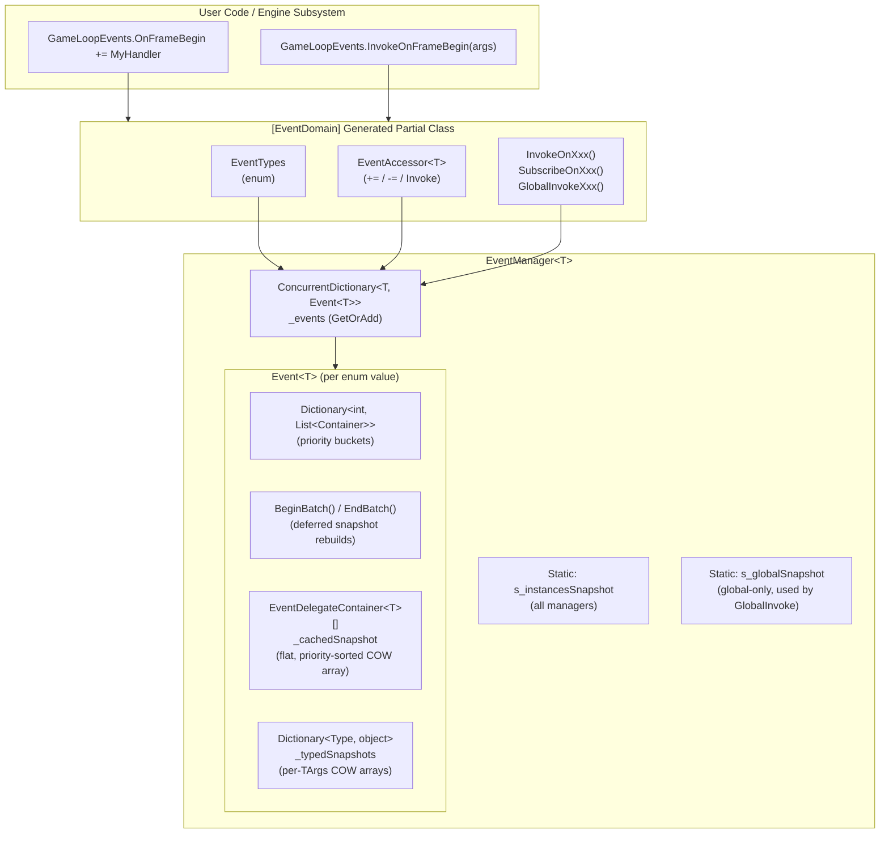

import Tabs from '@theme/Tabs';
import TabItem from '@theme/TabItem';

# Prowl Engine — Event System

## Overview

The Prowl Event System is a strongly-typed, source-generated publish/subscribe system designed for decoupled communication between engine subsystems, editor components, and gameplay code. It replaces traditional C# events and manual delegate lists with a structured approach that provides:

:::info Key Features at a Glance

| Feature | Description |
|---------|-------------|
| **Compile-time safety** | Roslyn source generator produces typed `Invoke`, `Subscribe`, and `GlobalInvoke` methods |
| **Priority-ordered dispatch** | Handlers execute in ascending priority order (lower values first) |
| **Event cancellation** | `ICancellable` argument types can stop propagation mid-chain |
| **Copy-on-write snapshots** | Safe to add/remove handlers during dispatch |
| **Global broadcast** | Managers marked as `Global` participate in static `GlobalInvoke` calls |
| **Automatic lifetime management** | `IDisposable` containers for deterministic unsubscription |
| **Lifecycle-aware subscriptions** | Handlers bound to `EngineObject` auto-unsubscribe on disposal |
| **Batch subscribe** | `BeginBatch()` / `EndBatch()` defers COW rebuilds during bulk ops |
| **DEBUG diagnostics** | Source file, line number, and slow-handler timing in debug builds |

:::

---

## Architecture



---

## Core Types

### EventManager\<T\>

**File:** `Prowl.Runtime/EventSystem/EventManager.cs`

The central hub for a set of events defined by an enum `T`. Each enum value maps to an atomically-created `Event<T>` instance (via `ConcurrentDictionary.GetOrAdd`).

<details>
<summary><strong>📋 Full API Reference — EventManager&lt;T&gt;</strong></summary>

| Member | Description |
|--------|-------------|
| `EventManager(bool global = false)` | Constructor. Pass `true` to include this manager in `GlobalInvokeEvent` broadcasts. |
| `Global` | Gets/sets whether this manager participates in global broadcasts. Changing this rebuilds the global snapshot. |
| `Enabled` | Gets/sets the enabled state. Disabled managers silently skip all invocations. |
| `AddNewDelegate<TArgs>(T, Action<TArgs>, int priority)` | Registers a typed handler. Returns a disposable `EventDelegateContainer<T, TArgs>`. |
| `AddNewDelegate(T, Action, int priority)` | Registers a parameterless handler (uses `Unit` internally). |
| `AddNewDelegate<TArgs>(EngineObject, T, Action<TArgs>, int priority)` | Registers a **lifecycle-aware** typed handler that auto-unsubscribes when the owner is disposed. |
| `AddNewDelegate(EngineObject, T, Action, int priority)` | Registers a **lifecycle-aware** parameterless handler. |
| `RemoveDelegate(EventDelegateContainer<T>)` | Removes a specific delegate container. |
| `RemoveDelegate(T, Delegate)` | Removes the first delegate matching the given handler. |
| `InvokeEvent<TArgs>(T, TArgs)` | Invokes all handlers for the given event with typed arguments. |
| `InvokeEvent(T)` | Invokes all parameterless handlers for the given event. |
| `EnableEvent(T)` / `DisableEvent(T)` | Enables/disables a specific event type. |
| `BeginBatch()` / `EndBatch()` | Defers COW snapshot rebuilds during bulk subscriptions. Nestable. |
| `static GlobalInvokeEvent<TArgs>(T, TArgs)` | Broadcasts to all enabled global managers (via dedicated global snapshot). |
| `static GlobalInvokeEvent(T)` | Parameterless global broadcast. |
| `Dispose()` | Removes the manager from the global pool and disables all events. |

</details>

### Event\<T\>

**File:** `Prowl.Runtime/EventSystem/Event.cs`

Represents a single event type within a manager. Maintains priority-bucketed delegate lists and copy-on-write snapshot arrays for lock-free invocation.

<details>
<summary><strong>📋 Full API Reference — Event&lt;T&gt;</strong></summary>

| Member | Description |
|--------|-------------|
| `EventType` | The enum value this event represents. |
| `Enabled` | Volatile flag; disabled events skip invocation. |
| `Invoke<TArgs>(TArgs)` | Iterates the typed COW snapshot. Supports `ICancellable` short-circuiting. In DEBUG builds, per-handler timing logs slow handlers. |
| `GetHandlers<TArgs>()` | Returns a `ReadOnlySpan` of currently registered typed handlers. |
| `Add(EventDelegateContainer<T>)` | Adds a handler and rebuilds snapshots (deferred if batching). |
| `Remove(EventDelegateContainer<T>)` | Removes a handler and rebuilds snapshots (deferred if batching). |
| `BeginBatch()` / `EndBatch()` | Defers snapshot rebuilds during bulk operations. Nestable. |
| `static SlowHandlerThresholdMs` | DEBUG-only: configurable threshold (default 5.0ms). Handlers exceeding this are logged. |

</details>

:::note Snapshot Architecture

When handlers are added or removed, `RebuildSnapshot()` constructs:
1. A flat `EventDelegateContainer<T>[]` sorted by priority.
2. Per-`TArgs` typed arrays stored in `_typedSnapshots`. `Invoke<TArgs>` retrieves the matching array with a single dictionary lookup and iterates it with direct virtual calls — **zero per-element type checks at runtime**.

:::

### EventDelegateContainer\<T\> / EventDelegateContainer\<T, TArgs\>

**File:** `Prowl.Runtime/EventSystem/EventDelegateContainer.cs`

Wraps a handler delegate with metadata (priority, event type, enabled state) and provides `IDisposable` for self-unsubscription.

<details>
<summary><strong>📋 API Reference</strong></summary>

| Member | Description |
|--------|-------------|
| `Priority` | Integer priority (ascending order; negative values run first). |
| `Enabled` | Per-handler enable/disable toggle. |
| `Dispose()` | Removes this handler from its parent event. |
| `SourceFile`, `SourceLine`, `SourceMember` | DEBUG-only: source location where the handler was registered. |

</details>

### EventAccessor\<TEnum\> / EventAccessor\<TEnum, TArgs\>

**File:** `Prowl.Runtime/EventSystem/EventAccessor.cs`

Lightweight `readonly struct` enabling familiar C#-style `+=` / `-=` subscription syntax and `.Invoke()` invocation.

```csharp title="EventAccessor usage"
// Parameterless
GameLoopEvents.OnFrameBegin += MyHandler;
GameLoopEvents.OnFrameBegin -= MyHandler;
GameLoopEvents.OnFrameBegin.Invoke();

// Typed
GameLoopEvents.OnFrameEnd += (args) => { ... };
GameLoopEvents.OnFrameEnd.Invoke(args);
```

### ICancellable

**File:** `Prowl.Runtime/EventSystem/ICancellable.cs`

```csharp title="ICancellable.cs"
public interface ICancellable
{
    bool Cancelled { get; set; }
}
```

:::tip Zero-cost abstraction

When an event argument type implements `ICancellable`, the invocation loop checks `Cancelled` after each handler. If `true`, remaining handlers are skipped. The check uses a **JIT-time static boolean** so non-cancellable events pay **zero cost**.

:::

---

## Source Generator (EventDomain)

**File:** `Prowl.EventSystem.Generators/EventDomainGenerator.cs`

The `EventDomainGenerator` is a Roslyn incremental source generator that eliminates boilerplate for defining event groups.

### Defining an Event Domain

```csharp title="Defining a static event domain" showLineNumbers
[EventDomain(Global = true)]
public static partial class GameLoopEvents
{
    [EventArgs(typeof(FrameBeginArgs))]
    private static readonly EventKey _OnFrameBegin = new();

    [EventArgs(typeof(Unit))]
    private static readonly EventKey _OnClosing = new();
}
```

### What Gets Generated

:::info Generator Output

The generator produces:

1. A backing `enum EventTypes` with one value per event
2. An `EventManager<EventTypes>` field (static or instance)
3. `EventAccessor` properties for `+=` / `-=` syntax
4. `InvokeOnXxx()`, `SubscribeOnXxx()`, and `GlobalInvokeOnXxx()` convenience methods

:::

### Static vs Instance Domains

| Feature | Static Domain | Instance Domain |
|---------|---------------|-----------------|
| Class declaration | `static partial class` | `partial class` |
| Manager storage | `private static readonly` field | `private readonly` field |
| Convenience methods | `static` | Instance methods |
| `GlobalInvoke` | Always `static` | Always `static` |
| Isolation | Single shared manager | Each instance has its own `EventManager` |

---

## Usage Guide

### Subscribing to Events

<Tabs>
  <TabItem value="operator" label="+= / -= (Quick)" default>

The simplest way to subscribe — familiar C# event syntax:

```csharp title="Operator syntax"
GameLoopEvents.OnFrameBegin += MyHandler;
GameLoopEvents.OnFrameBegin -= MyHandler;
```

  </TabItem>
  <TabItem value="subscribe" label="SubscribeOnXxx (Priority)">

Use the generated `SubscribeOnXxx` methods for **priority control** and **IDisposable** cleanup:

```csharp title="Priority subscription with IDisposable"
var sub = MyEvents.SubscribeOnScoreChanged(
    handler: (args) => UpdateUI(args),
    priority: 10
);
sub.Dispose(); // unsubscribes

// Or with using:
using var sub = MyEvents.SubscribeOnGameOver(() => ShowGameOverScreen());
```

  </TabItem>
  <TabItem value="lifecycle" label="Lifecycle-Aware (Auto-Cleanup)">

Bind a subscription to an `EngineObject`'s lifetime — **auto-removed when the owner is disposed**:

```csharp title="Lifecycle-aware subscription"
// Bound to an EngineObject — auto-removed when owner is disposed
manager.AddNewDelegate(this, eventType, (args) => HandleEvent(args));
manager.AddNewDelegate<MyArgs>(this, eventType, (args) => Process(args));
```

:::tip
This is the recommended pattern for MonoBehaviour scripts and components — no manual cleanup needed!
:::

  </TabItem>
</Tabs>

### Batch Subscribing

:::caution Performance

When many handlers are added in a tight loop (e.g., scene load), use `BeginBatch()` / `EndBatch()` to defer snapshot rebuilds — turning O(n²) array copies into a **single O(n log n) sort**.

:::

```csharp title="Batch subscription during scene load"
manager.BeginBatch();
for (int i = 0; i < components.Length; i++)
    manager.AddNewDelegate(eventType, components[i].OnUpdate);
// highlight-next-line
manager.EndBatch(); // single O(n log n) rebuild
```

### Invoking Events

```csharp title="Different ways to invoke events"
// Via EventAccessor
MyEvents.OnGameOver.Invoke();
MyEvents.OnScoreChanged.Invoke(new ScoreChangedArgs(oldScore, newScore));

// Via convenience method
MyEvents.InvokeOnGameOver();

// Via global broadcast (reaches all global managers)
// highlight-next-line
MyEvents.GlobalInvokeOnScoreChanged(new ScoreChangedArgs(0, 100));
```

### Priority Ordering

Handlers execute in **ascending priority order** (lower values first):

```csharp title="Priority ordering example"
MyEvents.SubscribeOnGameOver(() => Console.Write("C"), priority: 2);
MyEvents.SubscribeOnGameOver(() => Console.Write("A"), priority: 0);
MyEvents.SubscribeOnGameOver(() => Console.Write("B"), priority: 1);

MyEvents.InvokeOnGameOver(); // Output: "ABC"
```

:::tip
Use negative priorities for handlers that must run before everything else (e.g., validation).
:::

### Event Cancellation

```csharp title="Cancellable event args" showLineNumbers
public class ValidateArgs : ICancellable
{
    public bool Cancelled { get; set; }
    public string Input { get; set; }
}

// Handler with priority 0 runs first
ValidationEvents.SubscribeOnValidate(args =>
{
    if (string.IsNullOrEmpty(args.Input))
        // highlight-next-line
        args.Cancelled = true; // stops further handlers
}, priority: 0);
```

:::danger
Once `Cancelled` is set to `true`, **all remaining handlers are skipped**. Use this carefully — only for validation or guard-type scenarios.
:::

### Enabling / Disabling Events

| Level | API | Effect |
|-------|-----|--------|
| **Manager** | `manager.Enabled = false` | All events silenced |
| **Event** | `manager.DisableEvent(eventType)` | Specific event silenced |
| **Handler** | `container.Disable()` | Specific handler skipped |

:::note
Disabled managers, events, and handlers are **silently skipped** during invocation — no exceptions, no warnings. Re-enable them at any time to resume dispatch.
:::

---

## Built-in Event Domains

### GameLoopEvents

| Event | Args Type | Description |
|-------|-----------|-------------|
| `OnInitialized` | `InitializedArgs` | Engine and window fully initialized |
| `OnFrameBegin` | `FrameBeginArgs` | Start of each frame |
| `OnFrameEnd` | `FrameEndArgs` | After all update logic |
| `OnRenderComplete` | `RenderCompleteArgs` | After rendering is complete |
| `OnClosing` | `ClosingArgs` | Application window is closing |

### RenderingEvents

| Event | Args Type | Description |
|-------|-----------|-------------|
| `OnBeginRender` | `Unit` | Before any scene rendering |
| `OnEndRender` | `Unit` | After all rendering complete |
| `OnShadowsReady` | `Unit` | After shadow atlas initialized |

### PhysicsEvents

| Event | Args Type | Description |
|-------|-----------|-------------|
| `OnPrePhysicsStep` | `PhysicsStepArgs` | Before physics world steps |
| `OnPostPhysicsStep` | `PhysicsStepArgs` | After physics world steps |

### SceneManagerEvents

| Event | Args Type | Description |
|-------|-----------|-------------|
| `OnSceneLoaded` | `SceneEventArgs` | After a scene is loaded |
| `OnSceneUnloaded` | `SceneEventArgs` | After a scene is unloaded |

### AssetEvents

| Event | Args Type | Description |
|-------|-----------|-------------|
| `OnAssetsRefreshed` | `Unit` | After asset database refresh |
| `OnAssetsImported` | `AssetImportedArgs` | Files imported into project |
| `OnAssetDeleted` | `AssetDeletedArgs` | Asset deleted from project |

### Other Domains

- **DpiEvents** — DPI scale changes
- **DebugEvents** — Debug log messages
- **BaseEvents** — Update lifecycle (BeforeUpdate, AfterUpdate, etc.)
- **EditorEvents** — Play mode changes, assembly reload, error logging

---

## Thread Safety

- **Atomic event creation** — `GetOrCreateEvent` uses `ConcurrentDictionary.GetOrAdd` for race-free `Event<T>` creation
- **Copy-on-write snapshots** — `Invoke` reads immutable snapshot arrays without locking
- **Global snapshot** — dedicated `s_globalSnapshot` for global-only managers; rebuilt on flag changes
- **Safe self-removal** — handlers can unsubscribe during dispatch
- **Volatile enabled flags** — visibility across threads without full locking
- **Locks only during mutations** — add/remove/rebuild, never during invocation

---

## Best Practices

1. **Use `readonly record struct` for argument types** — avoids heap allocations
2. **Prefer `SubscribeOnXxx()` over `+=`** when you need priority control or deterministic cleanup
3. **Always dispose instance domain managers** — prevents leaks from the static instance list
4. **Use `class` for cancellable arguments** — value types are passed by value, so `Cancelled = true` won't propagate back
5. **Keep priorities simple** — 0 for normal, negative for "before", positive for "after"
6. **Prefer domain-specific events** — separate `EventKey` fields over generic catch-all events
7. **Use lifecycle-aware subscriptions for EngineObject-owned handlers** — `AddNewDelegate(owner, ...)` auto-unsubscribes on dispose
8. **Use `BeginBatch()` / `EndBatch()` during scene load** — defers snapshot rebuilds to avoid O(n²) copies

---

## File Reference

| File | Description |
|------|-------------|
| `Prowl.Runtime/EventSystem/EventManager.cs` | Central event hub |
| `Prowl.Runtime/EventSystem/Event.cs` | Single event type with COW snapshots |
| `Prowl.Runtime/EventSystem/EventDelegateContainer.cs` | Handler wrappers |
| `Prowl.Runtime/EventSystem/LifecycleEventDelegateContainer.cs` | Lifecycle-aware handler wrappers (auto-unsub on owner dispose) |
| `Prowl.Runtime/EventSystem/EventAccessor.cs` | `+=` / `-=` / `.Invoke()` syntax |
| `Prowl.Runtime/EventSystem/EventKey.cs` | Marker struct for event declarations |
| `Prowl.Runtime/EventSystem/EventDomainAttribute.cs` | Domain attribute |
| `Prowl.Runtime/EventSystem/EventArgsAttribute.cs` | Args type attribute |
| `Prowl.Runtime/EventSystem/EventArgsContract.cs` | Runtime type-safety validation |
| `Prowl.Runtime/EventSystem/ICancellable.cs` | Cancellation interface |
| `Prowl.EventSystem.Generators/EventDomainGenerator.cs` | Source generator |
| `Prowl.Runtime.Test/EventSystemTests.cs` | Unit tests |
| `Prowl.Runtime.Test/EventDomainGeneratorTests.cs` | Generator tests |
