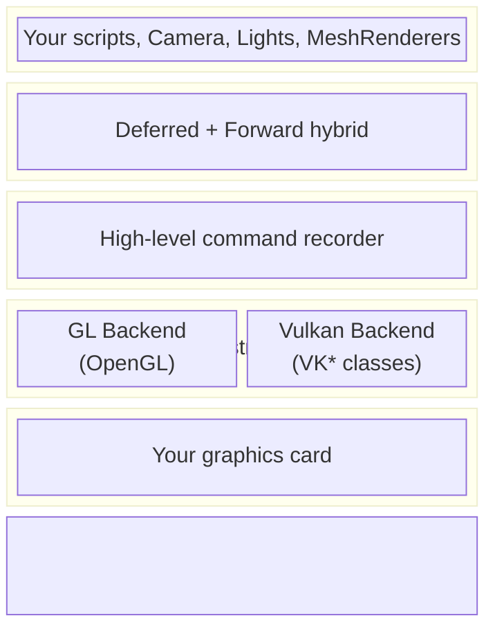
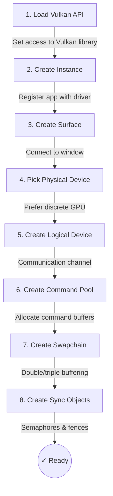
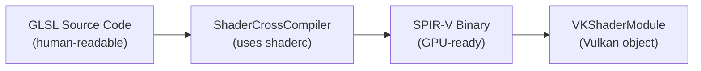
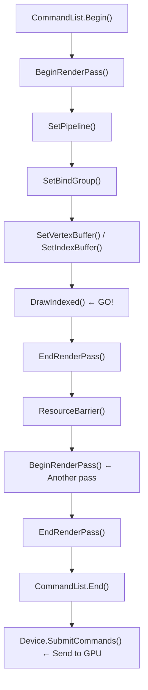
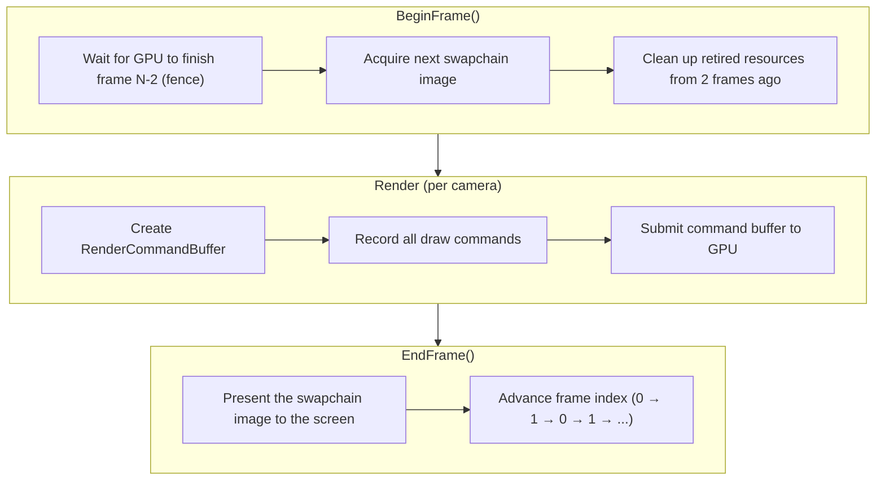
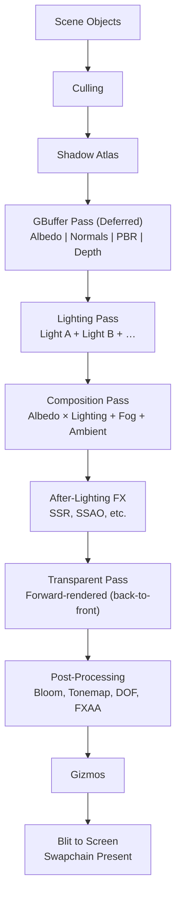

# Prowl Engine — Vulkan Rendering Pipeline

:::tip Who is this for?

This is a **beginner-friendly** explanation of how the Prowl game engine draws things on screen using its Vulkan rendering backend. No prior Vulkan knowledge required!

:::

---

## 1. What Is a Rendering Pipeline?

Imagine you're painting a scene. You'd probably follow a process:

1. **Sketch the outlines** of every object.
2. **Fill in the base colors**.
3. **Add lighting and shadows**.
4. **Apply final touches** — blur, glow, color correction.
5. **Frame it and hang it on the wall** (display it on screen).

A **rendering pipeline** is exactly this, but performed by your GPU millions of times per second. It's a series of ordered steps that transform 3D objects (meshes, materials, lights) into the 2D image you see on your monitor.

**Vulkan** is one of the "languages" you can use to communicate with the GPU. It's very explicit and low-level — you tell the GPU *exactly* what to do, step by step.

---

## 2. High-Level Architecture

Prowl's rendering stack is organized in layers:

Prowl supports both OpenGL and Vulkan through a shared abstraction called **Graphite**.

:::info

The rendering pipeline code doesn't talk to Vulkan directly — it talks to **Graphite**, and Graphite translates those calls into whichever backend is active. This means your game code works identically across all backends.

:::

---

## 3. The Graphite Abstraction Layer

### The Device (`GraphiteDevice`)

The central hub is `GraphiteDevice` — an abstract class with methods like:

<strong>📋 GraphiteDevice API</strong>

| Method | What It Does |
|--------|-------------|
| `CreateBuffer(...)` | Allocates memory on the GPU for vertex data, uniforms, etc. |
| `CreateTexture(...)` | Creates an image the GPU can read/write |
| `CreateShaderModule(...)` | Loads a compiled shader program onto the GPU |
| `CreatePipelineState(...)` | Bundles shaders + rendering settings into a pipeline |
| `CreateCommandList()` | Creates a recorder for GPU commands |
| `SubmitCommands(...)` | Sends recorded commands to the GPU |
| `BeginFrame()` / `EndFrame()` | Manages per-frame synchronization and swapchain image acquisition |

The Vulkan implementation is `VKGraphiteDevice`, which translates every Graphite call into Vulkan API calls using **Silk.NET**.

---

## 4. Vulkan Device Initialization

### Swapchain

:::note Swapchain Configuration

The swapchain uses **2 frames in flight** (`MaxFramesInFlight = 2`) and prefers **BGRA8 Unorm** format with **Mailbox** present mode (low-latency).

:::

---

## 5. Core GPU Resources

### Buffers (`VKBuffer`)

| Buffer Type | What It Stores |
|-------------|---------------|
| **Vertex Buffer** | Position, color, UV coordinates of mesh vertices |
| **Index Buffer** | Which vertices form which triangles |
| **Uniform Buffer** | Shader constants (camera matrices, time, light data) |
| **Storage Buffer** | Large read/write data for compute shaders |

### Textures (`VKTexture`)

Textures can be sampled (read by shaders), render targets (written to by the GPU), or depth/stencil buffers.

:::info

Vulkan requires explicit **image layout transitions** via pipeline barriers — the GPU needs to know how a texture will be used before it can access it.

:::

### Samplers (`VKSampler`)

Control how textures are read — filtering (nearest vs linear), wrapping (repeat, clamp), and anisotropy.

### Fences (`VKFence`)

Synchronization primitives — the GPU raises a flag when it finishes work, and the CPU can wait on it.

---

## 6. Shaders and Cross-Compilation

Prowl's shaders are written in **GLSL** but Vulkan requires **SPIR-V**. The `ShaderCrossCompiler` handles this:

After compilation, `SpirvReflection` parses the binary to discover uniform buffers, textures, and binding slots.

---

## 7. Command Lists

In Vulkan, you **record** commands into a **command buffer**, then **submit** the whole list at once:

---

## 8. The Frame Lifecycle

---

## 9. The Default Render Pipeline

The `DefaultRenderPipeline` uses **deferred rendering** with a **forward pass** for transparent objects.

### Visual Summary

### Phase-by-Phase

| Phase | Description |
|-------|-------------|
| **Setup** | Validate resources, create command buffer, upload global uniforms |
| **Culling** | Frustum culling + layer culling to skip invisible objects |
| **Shadow Atlas** | Depth-only render of shadow-casting lights into a shared atlas |
| **GBuffer** | Deferred pass — store albedo, normals, PBR properties, and depth |
| **Lighting** | Accumulate light contributions using additive blending |
| **Composition** | Combine albedo × lighting + fog + ambient + emissive |
| **Depth Copy** | Copy GBuffer depth to the composed output |
| **After-Lighting FX** | SSR, SSAO, and other screen-space effects |
| **Transparent** | Forward-rendered, back-to-front sorted |
| **Post-Processing** | Tonemapping, bloom, DOF, FXAA, color grading |
| **Gizmos** | Editor debug visualization |
| **Blit to Screen** | Copy final image to swapchain for display |

### GBuffer Layout

<strong>🎨 GBuffer Layout Details</strong>

| Buffer | Contents | Purpose |
|--------|----------|---------|
| **A** | RGB = Albedo, A = Alpha | Base color |
| **B** | RGB = Normal (view-space), A = Shading Mode | Surface direction |
| **C** | R = Roughness, G = Metalness, B = Specular, A = AO | Material properties |
| **D** | Custom data per shading mode | Extra data (e.g., emissive) |
| **Depth** | Depth values | Distance from camera |

---

## 10. The Material Binding System

`GraphiteMaterialBinder` bridges Prowl's property system with Vulkan's descriptor model:

1. Read shader reflection to discover expectations
2. Pack uniform data into GPU buffers
3. Resolve textures (or fall back to 1×1 white)
4. Create a Bind Group (descriptor set)
5. Retire temporary resources for deferred cleanup

:::caution Property Resolution Order

**Per-object → Material → Global** — properties set on the object override material defaults, which override global defaults.

:::

---

## 11. Pipeline State Caching

Pipeline State Objects (PSOs) bundle shaders + vertex layout + rasterizer settings + render pass compatibility. `PipelineStateCache` stores them by configuration hash to avoid expensive re-creation.

---

## 12. Synchronization

| Type | Scope | Purpose |
|------|-------|---------|
| **Semaphores** | GPU ↔ GPU | Image available / render finished signaling |
| **Fences** | CPU ↔ GPU | Frame-in-flight synchronization |
| **Pipeline Barriers** | Within command buffer | Image layout transitions and memory ordering |

---

## 13. Swapchain and Presenting

| Setting | Choice | Why |
|---------|--------|-----|
| **Format** | B8G8R8A8 Unorm | Standard display format |
| **Present Mode** | Mailbox (preferred) / FIFO (fallback) | Low latency / vsync |
| **Image Count** | min + 1 (usually 3) | Triple buffering |

Window resize triggers `ResizeSwapchain()` — waits for GPU, then recreates.

---

## 14. Glossary

| Term | Definition |
|------|-----------|
| **Bind Group** | A set of resources bound for shader access (Vulkan descriptor sets) |
| **Command Buffer/List** | Recorded sequence of GPU commands |
| **Deferred Rendering** | Store surface data first, calculate lighting separately |
| **Fence** | CPU-GPU synchronization object |
| **Forward Rendering** | Each object evaluates all lighting in its own draw call |
| **GBuffer** | Screen-sized textures storing surface properties |
| **GLSL** | OpenGL Shading Language |
| **Image Layout** | Internal texture memory arrangement |
| **Pipeline Barrier** | Ensures one GPU operation finishes before another begins |
| **PSO** | Pipeline State Object — compiled shader + state bundle |
| **Render Pass** | Defined scope of rendering operations |
| **Semaphore** | GPU-GPU synchronization object |
| **SPIR-V** | Compiled binary shader format for Vulkan |
| **Swapchain** | Images rotating between render and display |
| **UBO** | Uniform Buffer Object — constant data for shaders |

---

## Source File Reference

| File | Role |
|------|------|
| `Prowl.Runtime/Graphite/GraphiteDevice.cs` | Abstract GPU device interface |
| `Prowl.Runtime/Graphite/Vulkan/VKGraphiteDevice.cs` | Vulkan device implementation |
| `Prowl.Runtime/Graphite/Vulkan/VKCommandList.cs` | Vulkan command buffer recording |
| `Prowl.Runtime/Graphite/Vulkan/VKPipelineState.cs` | Vulkan graphics pipeline creation |
| `Prowl.Runtime/Graphite/Vulkan/VKShaderModule.cs` | SPIR-V shader module wrapper |
| `Prowl.Runtime/Graphite/Vulkan/VKTexture.cs` | Vulkan texture + layout transitions |
| `Prowl.Runtime/Graphite/Vulkan/VKBuffer.cs` | Vulkan buffer management |
| `Prowl.Runtime/Graphite/Vulkan/VKBindGroup.cs` | Vulkan descriptor set/pool management |
| `Prowl.Runtime/Rendering/RenderPipeline.cs` | Base render pipeline |
| `Prowl.Runtime/Rendering/DefaultRenderPipeline.cs` | Full deferred+forward implementation |
| `Prowl.Runtime/Rendering/RenderCommandBuffer.cs` | High-level Graphite command wrapper |
| `Prowl.Runtime/Rendering/GraphiteMaterialBinder.cs` | Property→BindGroup bridge |
| `Prowl.Runtime/Rendering/PipelineStateCache.cs` | PSO caching |
